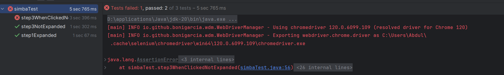

## Find a bug

Clone the [Simba Organizer repository](https://github.com/selabs-ur1/doodle) and follow the instructions to run the application on your machine.

Find a bug in the application. 

With the help of Selenium and the Page Object Model desing pattern write a simple test that fails for this bug.

Optionally make a pull request to the project.

Include in this document the code of the test and, if you did it, the link to the pull request.

## Answer


We've discovered a bug that permits users to bypass earlier steps and directly access the final step by clicking on
the desired step number.

In our example, initializing the driver places us at the first step, as shown by the 'step1Expanded' test.
This behavior is illustrated in the 'step3WhenClickedNotExpanded' test, where, upon clicking, we observe a transition to the third step.
This issue is also shown in the picture through the associated logs.

```java
import io.github.bonigarcia.wdm.WebDriverManager;
import org.junit.Before;
import org.junit.Test;
import org.openqa.selenium.By;
import org.openqa.selenium.WebDriver;
import org.openqa.selenium.WebElement;
import org.openqa.selenium.chrome.ChromeDriver;
import org.openqa.selenium.chrome.ChromeOptions;

import static org.junit.Assert.assertTrue;

public class simbaTest {

    WebDriver driver;


    @Before
    public void setUp() {
        ChromeOptions chromeOptions = new ChromeOptions();

        driver = new ChromeDriver(chromeOptions);

        WebDriverManager.chromedriver().setup();

        driver.get("http://localhost:4200/create");

    }

    @Test
    public void step1Expanded() {
        WebElement step3button = driver.findElement(By.xpath("/html/body/app-root/app-create-poll-component/div/div[1]/p-steps/div/ul/li[1]"));

        String ariaExpandedValue = step3button.getAttribute("aria-expanded");

        assertTrue(ariaExpandedValue.equals("true"));
    }

    @Test
    public void step3NotExpanded() {
        WebElement step3button = driver.findElement(By.xpath("/html/body/app-root/app-create-poll-component/div/div[1]/p-steps/div/ul/li[3]"));

        String ariaExpandedValue = step3button.getAttribute("aria-expanded");

        assertTrue(ariaExpandedValue.equals("false"));
    }

    @Test
    public void step3WhenClickedNotExpanded() {
        WebElement step3button = driver.findElement(By.xpath("/html/body/app-root/app-create-poll-component/div/div[1]/p-steps/div/ul/li[3]"));

        step3button.click();

        String ariaExpandedValue = step3button.getAttribute("aria-expanded");

        assertTrue(ariaExpandedValue.equals("false"));
    }
}

```
