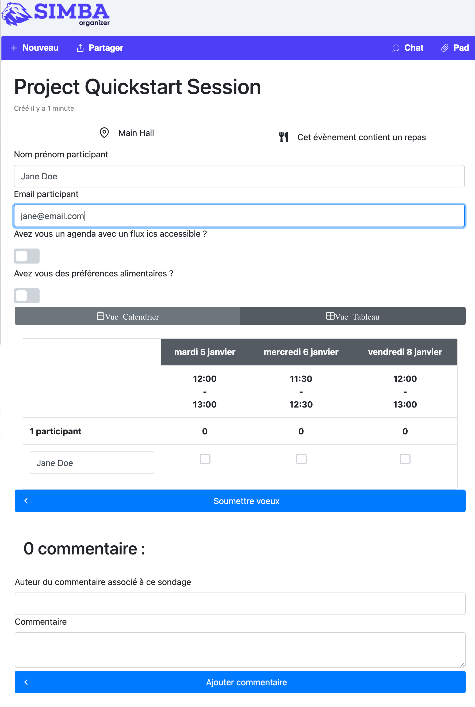

## Page Object Model

The image below shows the poll page of the [Simba Organizer](https://github.com/barais/doodlestudent/) application discussed in classes.



Write in this document the interface of a page object class for this page.

## Answer

N'ayant pas le code html de "Simba Organizer Poll page" j'ai inventé les noms des variables.

```java

package org.example;

import org.openqa.selenium.By;
import org.openqa.selenium.WebDriver;
import org.openqa.selenium.WebElement;

import java.util.List;

public class ProjectSession {
    protected WebDriver driver;

    public ProjectSession(WebDriver driver){
        this.driver = driver;
        if (!driver.getTitle().equals("Project Session")) {
            throw new IllegalStateException("This is not Project Session," +
                    " current page is: " + driver.getCurrentUrl());
        }
    }

    //get the name and email
    public void participant(String name, String email){
        driver.findElement(By.name("name")).sendKeys(name);
        driver.findElement(By.name("email")).sendKeys(email);
    }

    //submit the name of the participant and his choices
    public void selectedChoices(String participant_name) {
        driver.findElement(By.name("participant_name")).sendKeys(participant_name);

        List<WebElement> checkedDates = driver.findElements(By.className("date_selected"));
        for ( WebElement element : checkedDates) {
            element.click();
        }
        driver.findElement(By.name("send_choices")).click();
    }

    //add a comment
    public void addComments(String author, String comment) {
        driver.findElement(By.name("author")).sendKeys(author);
        driver.findElement(By.name("comment")).sendKeys(comment);
        driver.findElement(By.name("add_comment")).click();
    }

    //When "+ Nouveau" selected
    public void newProject(){
        driver.findElement(By.name("newProject")).click();
    }

    //When "Partager" selected
    public void share(){
        driver.findElement(By.name("share")).click();
    }

    //When "Chat" selected
    public void chat(){
        driver.findElement(By.name("chat")).click();
    }

    //When "Pad" selected
    public void pad(){
        driver.findElement(By.name("pad")).click();
    }
    //When "Vue Calendrier" selected
    public void calendarVue(){
        driver.findElement(By.name("calendarVue")).click();
    }

    //When "Vue Tableau" selected
    public void arrayVue(){
        driver.findElement(By.name("arrayVue")).click();
    }

    //When "Vue Calendrier" selected
    public void fluxIcs(){
        driver.findElement(By.name("fluxIcs")).click();
    }

    //When "Vue Tableau" selected
    public void foodPreference(){
        driver.findElement(By.name("foodPreference")).click();
    }
}
```