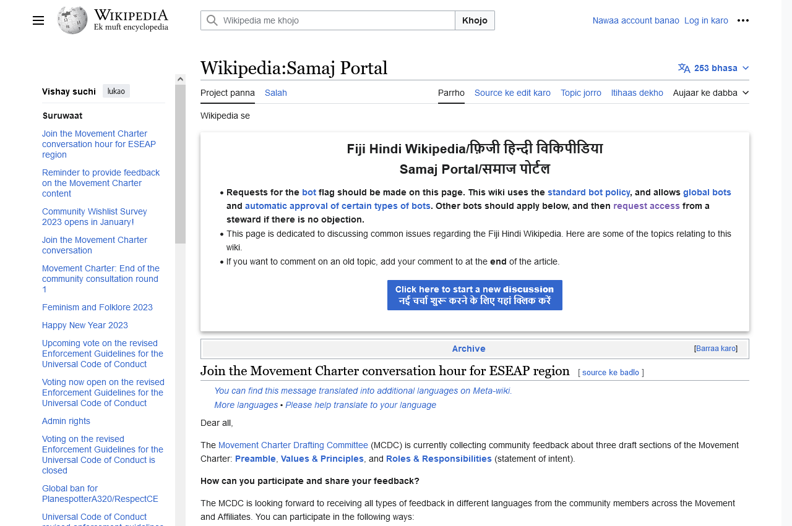

# Random Wikipedia walker

Using Selenium, create a small program that, starting from the main page https://www.wikipedia.org/, walks trough a
sequence of random links and takes a snapshot of the last page.
The process is as follows:

1. Navigate to the main page https://www.wikipedia.org/
2. Select a random link in the page
3. Navigate to the link
4. Repeat steps 2 to 3 until you have visited 10 different pages
5. Take a snapshot of the current page and save it

Include the code of the walker and the snapshot in this document.

## Answer

- Code : [RandomWikipediaWalker.java](../src/test/java/RandomWikipediaWalker.java)
- Snapshot : \
  
- Chemin :
    - Click on : https://meta.wikimedia.org/wiki/Terms_of_use/fr
    - Click on : https://meta.wikimedia.org/wiki/Special:MyLanguage/Main_Page
    - Click on : https://meta.wikimedia.org/wiki/Main_Page/skr
    - Click on : https://meta.wikimedia.org/wiki/Main_Page/zu
    - Click on : https://meta.wikimedia.org/wiki/Main_Page/mzn
    - Click on : https://meta.wikimedia.org/wiki/Main_Page/mzn#
    - Click on : https://meta.wikimedia.org/wiki/Main_Page/ang
    - Click on : https://meta.wikimedia.org/wiki/Main_Page/haw
    - Click on : https://meta.wikimedia.org/wiki/Special:MyLanguage/Steward_requests/Bot_status
    - Click on : https://hif.wikipedia.org/wiki/Wikipedia:Samaj_Portal 